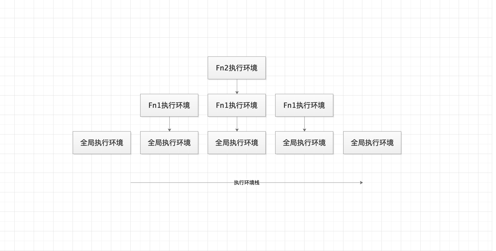

# Event Loop

js是单线程，通过异步实现多任务的处理，js的事件处理机制分为三个模块
- 主线程执行栈：负责执行同步任务，栈内Frame为执行环境。
- 堆：用来存放该执行环境中变量
- 执行队列：当异步任务准备好以后,会将该异步任务的回调函数放置在执行队列中。

## 执行环境

当任务执行时，会创造一个当前执行环境，而多个嵌套执行的任务会将执行环境推进栈中，一步步出栈执行。

```
function f1() {
    function f2() {

    }
    f2()
}
f1()
```
其中执行环境栈的变化如下


## js 事件机制

- 在主线程执行栈中只会入栈同步任务
- 在异步任务准备好以后，会将回调函数放入执行队列中。异步任务不由js引擎执行，一般由外部如浏览器等执行
  - 外部I/O：鼠标点击，键盘点击，移动等。通过addEventListener添加的异步任务。
  - ajax
  - Promise，process.nextTick
  - setTimout,setInterval（浏览器任务）
- 当主线程执行完同步任务后，如果异步队列不为空，会执行异步队列中回调函数。
- 循环第二步和第三步。

## 宏任务和微任务

- 宏任务：一般是js引擎和宿主执行环境发生交互产生的任务
  - 外部I/O
  - ajax
  - DOM回调
  - setImmediate
  - setTimeout，setInterval
- 微任务：一般是宏任务在线程中执行时产生的回调
  - Promise
  - process.nextTick
  - MutationObserver

- setImmediate(func): 在浏览器完成同步栈后立即执行func
- process.nextTick: 立即开始执行当前回调队列。
- 速度上process.nextTick > setImmediate(func)

在被加入异步队列的过程中，宏任务会被加到队列的尾端，而微任务会被加到队列的前端优先执行。
同级的宏任务和微任务也存在优先级

- 宏任务：主代码块 > setImmediate > MessageChannel > setTimeout/setInterval
- 微任务：process.nextTick > Promise > MutationObserver

***如果宏任务中嵌套了微任务，则会在执行完一个宏任务后立即清空所有微任务(包括嵌套的微任务)，再进行下一个宏任务，而在node11以下，会先进行当前级别的宏任务队列。再进行微任务***  
***宏任务中嵌套的宏任务会放在下一个时间步执行***

```
console.log('start')
setTimeout(() => {
    console.log('timeout1')
    setTimeout(() => {
        console.log('timeout3')
    })
    Promise.resolve().then(() => {
        console.log('promise1')
    })
}, 0)

setTimeout(() => {
    console.log('timeout2')
    setTimeout(() => {
        console.log('timeout4')
    })
    Promise.resolve().then(() => {
        console.log('promise2')
    })
})
console.log('end')
```
这段代码在node11以下输出
```
start
end
timeout1
timeout2
promise1
promise2
timeout3
timeout4
```
说明了同级别的宏任务会优先执行，再执行微任务
这段代码在浏览器输出
```
start
end
timeout1
promise1
timeout2
promise2
timeout3
timeout4
```
说明了宏任务执行完后会立即清空微任务，再执行宏任务。


async 函数await时相当于
```
async function async() {
  await awaitfunction
  console.log('async end')
}
```
```
async function async1() {
  Promise.resolve(awaitfunction).then(() => {
    console.log('async end')
  })
}
```
相当于await是立即执行，后面的加入微任务中执行。

```
setTimeout(()=> {
    console.log('settimeout1');
}, 0);

new Promise((resolve) => {
    console.log('p1')
    resolve()
    console.log('p2')
}).then(() => {
    console.log('p3');
})

console.log('global1')

setTimeout(() => {
    console.log('settimeout2')
}, 0);
```
输出
```
p1
p2
global1
p3
settimeout1
settimeout2
```

- setTimeout1作为宏任务加入异步队列
- Promise是立即执行，输出p1,p2
- Promise.then作为微任务加入到异步队列的最前端
- console.log同步任务立即执行，输出global1
- setTimout2作为宏任务加入异步队列
- 同步栈结束，开始执行异步队列，依次输出p3, settimout1, settimeout2
