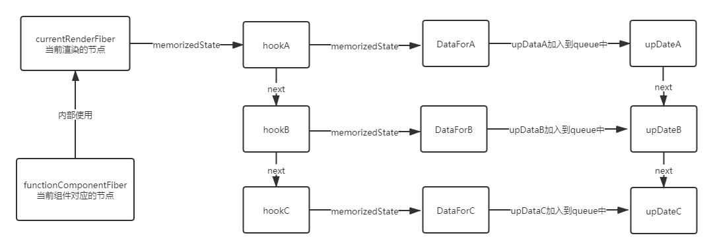

# 细节

## hook数据是怎么存储的

react中通过currentRenderingFiber来标志当前的渲染节点，hook数据保存在currentRenderingFiber的memorizedState中。  
通过链式单向链表的形式保存hook的数据。

```
{
    memorizedState: null
    next: nextHook
}
```

每次执行一个hook，currentRnderingFiber.memorizedState指针就往后移动一个，来遍历所有hook

## hook更新数据机制

每次调用hook提供的更改数据方法时，都会创建一个update对象
```
{
const update = {
    action: action(更新动作),
    next: null //指向下一次更新
}
}
```

多次更新state时，这些update对象会形成一条环状的更新链。  
这时hook对象包括
```
const hook = {
    memorizedState: null,
    next: null,
    baseState: null //代表了更新开始之前的状态
    queue: 更新链表
}
```

hook会依照baseState而不是memorizedState进行更新，因为有些优先级不够的会被跳过。memorizedState不一定等于baseState


