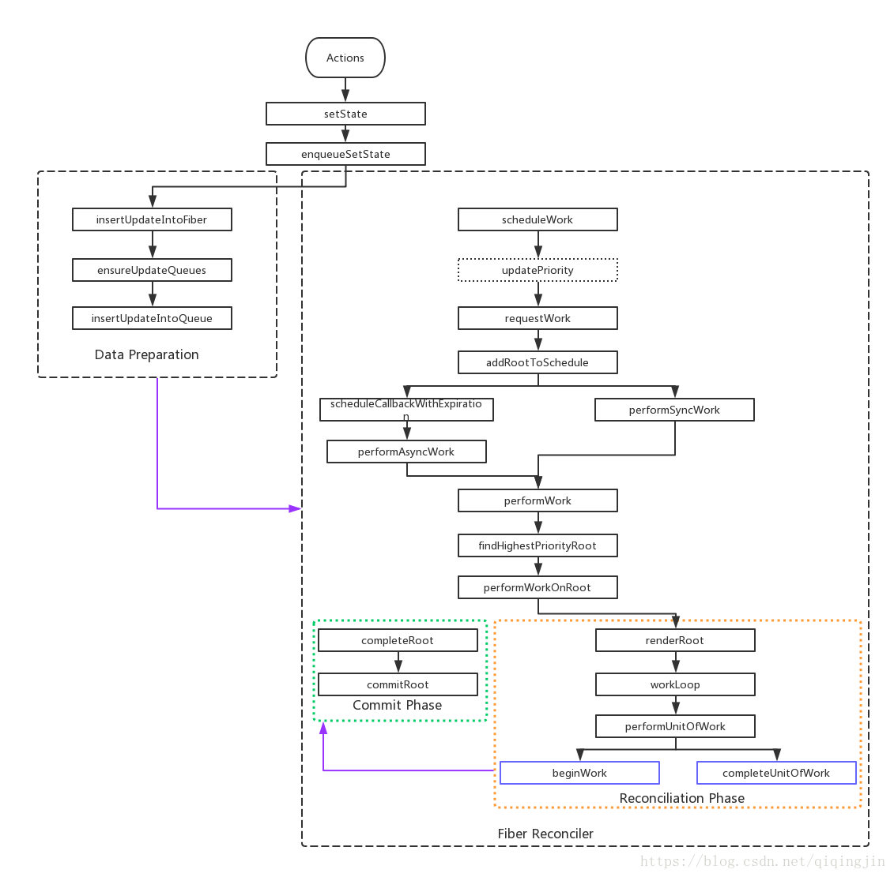

# fiber

## 为什么需要fiber

在以前react进行diff算法的时候是利用的js自带的递归调用栈，在执行过程中无法被打断。  
当需要更新的dom树很深很大的时候，就会造成diff过程长期占用js引擎，阻塞其他渲染过程，造成丢帧的影响。

## fiber是什么

fiber是一种机制。将渲染过程拆解成为一个个的小块穿插在浏览器任务中，让diff过程不会一直占用js引擎。

## fiber是怎么做到的

- fiber将递归调用栈的处理模式分成通过链表的多个子任务的处理模式。在多个子任务处理中利用requestIdleCallback,将diff过程插入到每帧中的剩余时间步中进行更新。并在时间步消耗完后让出cpu，给其他需要渲染的元素让路。
- fiber通过协调和提交两个阶段的分离，在保证正确性的同时能保证不长时间占用js引擎。
- 通过current fiber tree和workInProcess fiber tree的互相切换保证效率。

## fiber流程

fiber分为两个大阶段

1. 协调阶段
该阶段是diff阶段，找出所有有变化的节点。如节点的新增，删除，更新等。并作为effect存在  
该阶段可以被打断，延迟，重做多次  
componentWillMount, componentWillUpdate会在这里调用
2. 提交阶段
该阶段是同步的，一次性将所有effect进行更新。包括虚拟dom转换为真实dom，节点的新增，删除，更新会在这里触发。  
componentDidMount, componentDidUpdate会在这里调用

整个流程如下

### 开始更新

在调用setState后进行异步开启更新。  
为更新队列中的组件创建fiber节点，fiber节点的组成如下。

- 节点类型信息
- 结构信息，这里构成链式
  - child：子节点
  - sliding：兄弟节点
  - return：父节点
- effect信息，方便commit时候快速处理effect
  - nextEffect:下一个有effect的fiber节点
  - firstEffect
  - lastEffect
- 更新相关
  - updateQueue:更新队列
  - memorizedProps：更新前props
  - memorizedState：更新前State

### 调度阶段

调度器schedule通过requestIdleCallback将要进行diff的fiber节点进行执行。  
如果执行超时或者有更高优先级的任务进入，保存当前结果并中断，等待主进程再次空闲的时候进行。  

### 调和阶段（diff）

调和阶段以原有的fiber tree为蓝本，构建起一个workInProcess tree，该树就是修改后应该呈现的树。在diff完成后将两树交换首先复用。

***协调阶段***

- 找到更新队列中当前需要处理的fiber节点
- 执行diff算法进行比较
- 如果不需要更新，直接把子节点从原fiber复制过来。
- 如果需要更新，更新当前节点状态(props, state)，如果有effect（节点删除，增加，ComponentDidUpdate)，将自己加入effect链表中。
- 调用render拿到子节点，并通过链式调用更新子节点
- 如果没有子节点通过sliding更新兄弟节点
- 全部更新完毕后返回父节点。
- 得到workInProcess tree

在该过程中时间片耗尽则将该断点记录并在下一个时间片中执行。

***commit阶段***

- 通过遍历workInProcess tree的effect子树，拿到需要执行effect的节点
- 执行getSnapShotBeforeUpdate,ComponentWillUnmount周期
- 执行所有的dom更新，删除，新增操作
- 执行ComponentDidMount,ComponentDidUpdate周期
- 将workInProcess tree和current tree交换。

在commit阶段是同步的，不能被打断。结束后整个周期结束，页面更新。
