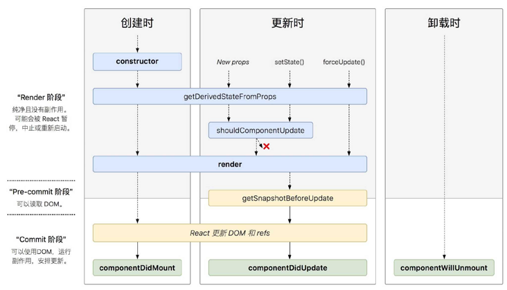

# react新生命周期

react新生命周期删除了以下三个生命周期

- componentWillReciveProps
- componentWillMount
- componentWillUpdate

新添加了两个生命周期

- getDerivedStateFromProps(nextProps, prevState):用来替代componentWillReciveProps,如果修改state返回修改后的state，否则返回null代表不修改。
- getSnapshotBeforeUpdate(prevProps, prevState):用来代替componentWillUpdate,但发生在render之后，渲染之前。返回的值会作为componentDidMount的第三个参数。

## 挂载

- constructor
- getDerovedStateFromProps
- render
- componentDidMount

## 更新

- getDerivedStateFromProps
- componentShouldUpdate
- render
- getSnapshotBeforeUpdate
- componentDidUpdate

## 卸载

- componentWillUnmount

