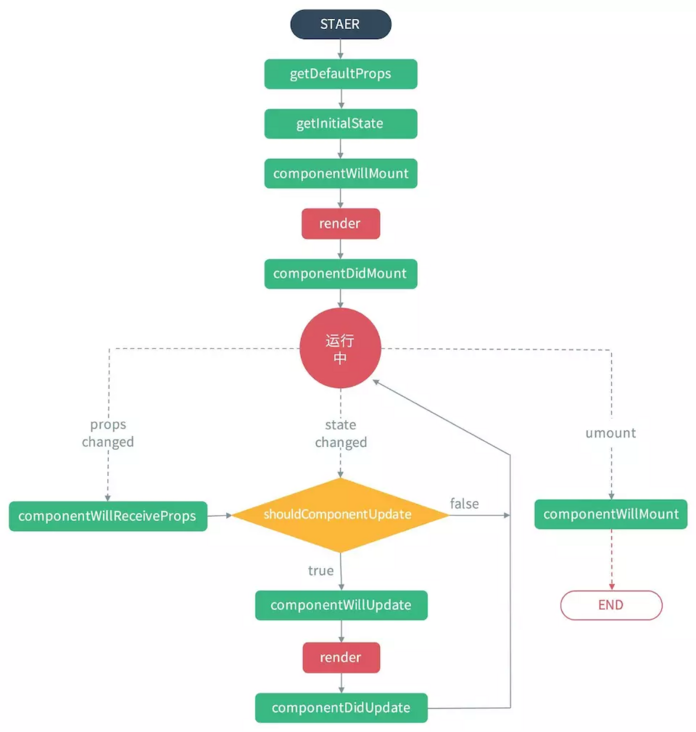

# react生命周期

react生命周期宏观上分为三个大的部分

- 挂载
- 更新
- 卸载

## 挂载阶段

- constructor:类初始化方法会被先执行，执行初始化state，绑定props，绑定方法的this。
- componentWillMount():在render之间执行，一般初始化都放在constructor中，不会放在这里，一般不使用这个
- render:渲染函数，该函数返回一个JSX类，但不会真正执行函数的渲染过程。必须是纯函数，不能setState
- componentDidMount():该函数在DOM真正被渲染后被执行，一般数据请求(ajax)等放在这里。注意该阶段不会紧贴着render执行，因为render只是返回JSX，真正的渲染还在后面。如果有多个并行的组件，他们的前三个阶段会依次执行而他们的did阶段会在之后挨着执行。```cons1- > will1 -> render1 -> cons2 -> will2 -> render2 -> did1 -> did2

## 更新阶段

- componentWillReciveProps(nextProps):该阶段在父组件的render函数触发后执行（不论props有无改变），通常比较新的props和现在props来更新state，使用setState不会触发该阶段
- componentShouldUpdate(nextProps, nextState):用来判断是否需要继续更新，是性能优化的关键。
- componentWillUpdate(nextProps, nextState):即将进行更新
- render()
- componentDidUpdate(prevProps, prevState):更新结束

## 卸载阶段

- componentWillUnmount():即将卸载。

