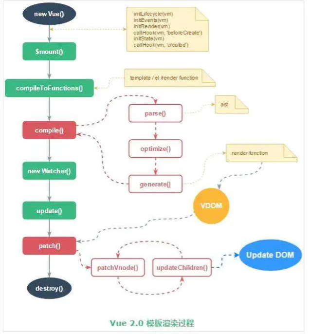

# vue模板渲染流程

vue模板渲染的流程发生在Created->mounted生命周期中  
其中created->beforeMount将template转换成render函数  
beforeMount->mounted将render函数执行生成虚拟dom，再将虚拟dom进行patch生成真实dom。

## 找到挂载节点

在执行$mount方法后，首先会去找到挂载节点，即指明的el节点。生成的dom将替换掉el的所有内容，所以不可以是body标签。  
vue使用querySelector找到挂载节点的元素。

## 提取模板字符串

- 如果没有template，则会将el包含的元素赋值给template变量
- 如果有template，将template的字符串赋值给template变量

## 编译成render函数

该阶段将template编译成为可执行的render函数。

### parse

在parse过程中使用正则表达式遍历模板中的指令，class，style等，形成一颗ast语法树

### optimize

优化过程中，会遍历ast语法树，为每个元素增加一个static标签，标志该元素里的数据是否为响应式的。如果不是响应式的后面diff的时候会直接跳过静态节点

### codegen

将优化过后的ast语法树转换为可执行的代码

## 创建虚拟dom

在render函数创建后会执行render函数创建虚拟dom。  
vue调用createElement执行得到虚拟dom。虚拟dom是一个包含着dom信息的存储在内存中的对象。  

## 创建真实dom

调用patch方法生成真实dom

